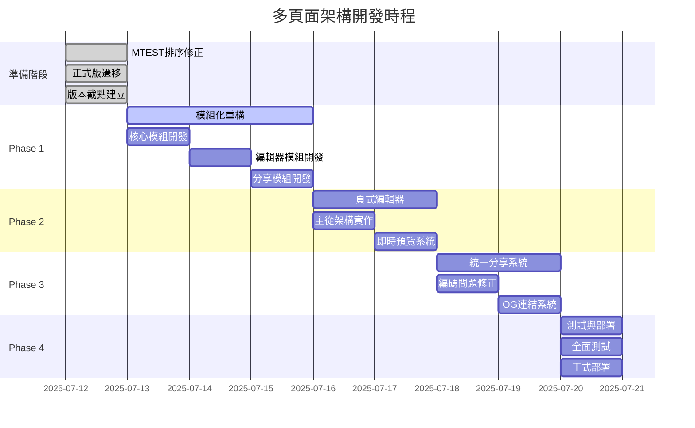

# 📋 2025-07-12 多頁面架構整合開發計劃

## 🔍 **現狀問題總結**

### 1. **附加卡片排序問題**
#### 問題描述
- TEST版本與正式版本的附加卡片排序機制不一致
- 用戶編輯後的卡片順序無法正確儲存和還原
- 拖拉排序功能與資料庫儲存的順序不同步

#### 修正方案
```javascript
// 目前的排序系統架構
const allCardsSortable = [
  { type: 'main', id: 'main', flex_json: {...}, img: '...' },
  { type: 'promo', id: 'promo1', flex_json: {...}, img: '...' },
  { type: 'promo', id: 'promo2', flex_json: {...}, img: '...' }
];

// 儲存時的card_order陣列
const card_order = allCardsSortable.map(c => c.id); // ['main', 'promo1', 'promo2']

// 載入時重建排序
card_order.forEach(cardId => {
  if (cardId === 'main') {
    // 重建主卡片
  } else {
    // 從promoCardList找到對應的宣傳卡片並重建
  }
});
```

#### 具體修正點
1. **統一排序邏輯**：確保TEST版本和正式版本使用相同的`card_order`處理機制
2. **同步問題修正**：拖拉排序後立即更新`allCardsSortable`和資料庫
3. **載入順序修正**：先載入宣傳卡片列表，再根據`card_order`重建用戶的排序

### 2. **程式碼肥大問題**
- **mcard-mtest.js**: 5000+ 行（主要問題）
- **重複程式碼**: 60-70%功能重複
- **維護困難**: 單檔案過大，難以定位修改

### 3. **分享功能問題**
- **Facebook/EMAIL分享頁面完全空白**
- **Instagram分享功能無法運作**
- **參數傳遞失敗**：中文字符編碼問題

## 🏗️ **一頁式電子報編輯器詳細設計**

### 1. **統一編輯器概念**
```
📝 一頁式電子報編輯器 (Universal Newsletter Editor)
├── 📄 主內容區域 (Master Content)
│   ├── 標題編輯
│   ├── 副標題編輯
│   ├── 主圖片上傳
│   ├── 顏色主題設定
│   └── 會員資訊區塊
├── 📎 附加卡片管理 (Slave Cards)
│   ├── 宣傳卡片選擇
│   ├── 活動卡片插入
│   ├── 卡片排序拖拉
│   └── 卡片預覽
└── 👁️ 即時預覽 (Live Preview)
    ├── 桌面版預覽
    ├── 手機版預覽
    └── 分享格式預覽
```

### 2. **編輯器核心功能**
```javascript
// 統一編輯器類別
class UniversalNewsletterEditor {
  constructor() {
    this.masterContent = new MasterContentManager();
    this.slaveCards = new SlaveCardsManager();
    this.livePreview = new LivePreviewManager();
    this.shareManager = new ShareManager();
  }
  
  // 即時編輯功能
  setupRealTimeEditing() {
    // 文字即時編輯
    this.bindTextInputs();
    
    // 顏色即時調整
    this.bindColorPickers();
    
    // 圖片即時上傳和預覽
    this.bindImageUploads();
    
    // 影片連結即時嵌入
    this.bindVideoLinks();
  }
  
  // 主從架構管理
  setupMasterSlaveArchitecture() {
    // 主模板管理
    this.masterTemplate = {
      header: { title: '', subtitle: '', image: '' },
      content: { text: '', links: [], media: [] },
      footer: { contact: '', buttons: [] }
    };
    
    // 從屬卡片管理
    this.slaveCards = {
      promo: [],      // 宣傳卡片
      event: [],      // 活動卡片
      cta: [],        // 行動呼籲卡片
      custom: []      // 自訂卡片
    };
  }
}
```

### 3. **分享平台統一介面**
```javascript
// 所有分享方式都使用相同的編輯器資料
class ShareManager {
  constructor(editorData) {
    this.editorData = editorData;
  }
  
  // LINE分享 (2-1)
  async shareToLine() {
    // 1. 整合主卡片和附加卡片
    const mainCard = this.generateMainCard(this.editorData);
    const promoCards = this.generatePromoCards(this.editorData.slaveCards);
    
    // 2. 組成carousel
    const flexMessage = {
      type: 'flex',
      altText: this.editorData.title,
      contents: {
        type: 'carousel',
        contents: [mainCard, ...promoCards]
      }
    };
    
    // 3. 使用LIFF分享
    await liff.init({ liffId: 'YOUR_LIFF_ID' });
    if (liff.isLoggedIn()) {
      await liff.shareTargetPicker([flexMessage]);
    }
  }
  
  // FB、IG等社交媒體分享 (2-2)
  async shareToSocial(platform) {
    // 1. 生成預覽頁面
    const previewUrl = await this.generatePreviewPage(this.editorData);
    
    // 2. 生成頁面截圖
    const screenshot = await this.captureScreenshot(previewUrl);
    
    // 3. 設定OG metadata
    const ogData = {
      title: this.editorData.title,
      description: this.editorData.description,
      image: screenshot,
      url: previewUrl
    };
    
    // 4. 根據平台分享
    switch(platform) {
      case 'facebook':
        this.shareToFacebook(ogData);
        break;
      case 'instagram':
        this.shareToInstagram(screenshot);
        break;
      case 'email':
        this.shareToEmail(ogData);
        break;
    }
  }
}
```

### 4. **資料庫整合**
```javascript
// 自動儲存機制
class AutoSaveManager {
  constructor(editorData) {
    this.editorData = editorData;
    this.saveTimer = null;
    this.isDirty = false;
  }
  
  // 監聽編輯變化
  watchChanges() {
    // 防抖動儲存 (1秒後儲存)
    this.saveTimer = setTimeout(() => {
      if (this.isDirty) {
        this.saveToDatabase();
        this.isDirty = false;
      }
    }, 1000);
  }
  
  // 儲存到資料庫
  async saveToDatabase() {
    const saveData = {
      page_id: this.editorData.pageId,
      line_user_id: this.editorData.userId,
      master_content: this.editorData.masterContent,
      slave_cards: this.editorData.slaveCards,
      card_order: this.editorData.cardOrder,
      flex_json: this.generateFlexJson(),
      updated_at: new Date().toISOString()
    };
    
    await fetch('/api/cards', {
      method: 'POST',
      headers: { 'Content-Type': 'application/json' },
      body: JSON.stringify(saveData)
    });
  }
}
```

## 🔧 **編碼方式改變的技術原因**

### 3. **為什麼要改變編碼方式？**

#### 問題原因
```javascript
// 現行編碼方式 (有問題)
const data = { title: "台灣美食卡", name: "李小華" };
const encoded = btoa(JSON.stringify(data)); // ❌ 失敗！

// 錯誤訊息：
// InvalidCharacterError: Failed to execute 'btoa' on 'Window': 
// The string to be encoded contains characters outside of the Latin1 range.
```

#### 技術原因分析
1. **btoa()函數限制**：
   - 只支援 Latin1 字符集 (ISO-8859-1)
   - 不支援中文、日文、韓文等多位元組字符
   - 中文字符超出 Latin1 範圍，導致編碼失敗

2. **UTF-8編碼問題**：
   - 中文字符需要 UTF-8 編碼
   - 直接使用 btoa() 無法處理 UTF-8 字符
   - 需要先轉換為 Latin1 相容格式

#### 解決方案
```javascript
// 新編碼方式 (UTF-8安全)
function safeEncode(data) {
  const jsonString = JSON.stringify(data);
  // 步驟1: UTF-8 → URL編碼
  const urlEncoded = encodeURIComponent(jsonString);
  // 步驟2: URL編碼 → Latin1相容
  const latin1Compatible = unescape(urlEncoded);
  // 步驟3: Latin1 → Base64
  const base64Encoded = btoa(latin1Compatible);
  return base64Encoded;
}

function safeDecode(encodedData) {
  // 步驟1: Base64 → Latin1
  const latin1String = atob(encodedData);
  // 步驟2: Latin1 → URL編碼
  const urlEncoded = escape(latin1String);
  // 步驟3: URL編碼 → UTF-8
  const utf8String = decodeURIComponent(urlEncoded);
  return JSON.parse(utf8String);
}
```

#### 編碼流程圖
```
中文資料 → JSON字串 → UTF-8編碼 → URL編碼 → Latin1相容 → Base64
   ↓                                                            ↓
 解碼後 ← JSON解析 ← UTF-8解碼 ← URL解碼 ← Latin1轉換 ← Base64解碼
```

## 📊 **多頁面架構重構計劃**

### 1. **模組化架構**
```
📁 public/js/modules/
├── 🔐 core/
│   ├── auth-manager.js      (~300行) - LINE認證管理
│   ├── data-manager.js      (~400行) - 資料管理與API
│   ├── form-manager.js      (~350行) - 表單處理
│   └── utils.js            (~200行) - 通用工具函數
├── 📝 editor/
│   ├── editor-core.js       (~500行) - 編輯器核心
│   ├── preview-renderer.js  (~400行) - 預覽渲染
│   ├── image-manager.js     (~300行) - 圖片管理
│   └── template-manager.js  (~250行) - 模板管理
├── 📤 share/
│   ├── share-core.js        (~400行) - 分享核心邏輯
│   ├── line-share.js        (~300行) - LINE分享
│   ├── social-share.js      (~350行) - 社交媒體分享
│   └── email-share.js       (~200行) - 郵件分享
└── 🎨 ui/
    ├── mobile-ui.js         (~400行) - 手機版UI
    ├── desktop-ui.js        (~300行) - 桌面版UI
    └── responsive-ui.js     (~200行) - 響應式UI
```

### 2. **頁面架構**
```
📁 public/
├── 🏠 index.html                    - 主入口
├── 🔐 line-auth-bridge.html         - LINE認證橋接
├── 📝 newsletter-editor.html        - 一頁式電子報編輯器
├── 📤 share-control.html            - 分享控制中心
└── 📂 share/
    ├── line-share.html              - LINE分享
    ├── facebook-share.html          - Facebook分享
    ├── instagram-share.html         - Instagram分享
    ├── email-share.html             - Email分享
    └── universal-share.html         - 通用分享
```

### 3. **載入策略**
```javascript
// 動態模組載入
class ModuleLoader {
  async loadEditorModules() {
    const [core, editor, ui] = await Promise.all([
      import('./modules/core/editor-core.js'),
      import('./modules/editor/preview-renderer.js'),
      import('./modules/ui/responsive-ui.js')
    ]);
    return { core, editor, ui };
  }
  
  async loadShareModules(platform) {
    const modules = await import(`./modules/share/${platform}-share.js`);
    return modules;
  }
}
```

## 🚀 **實作計劃**

### Phase 1: 緊急修復 (1天)
- [x] 分析附加卡片排序問題
- [ ] 修正TEST版本排序邏輯
- [ ] 修正分享功能編碼問題
- [ ] 增強錯誤處理機制

### Phase 2: 編輯器統一 (2天)
- [ ] 建立一頁式電子報編輯器
- [ ] 實作主從架構設計
- [ ] 整合即時編輯功能
- [ ] 統一分享介面

### Phase 3: 模組化重構 (3天)
- [ ] 拆分5000行程式碼
- [ ] 建立核心模組系統
- [ ] 實作動態載入機制
- [ ] 統一認證和資料管理

### Phase 4: 分享系統完善 (2天)
- [ ] 修正Facebook/Email分享問題
- [ ] 實作Instagram分享功能
- [ ] 建立OG連結系統
- [ ] 完善頁面截圖功能

### Phase 5: 測試與優化 (1天)
- [ ] 全面功能測試
- [ ] 效能優化調整
- [ ] 錯誤處理完善
- [ ] 文件更新

## 📈 **預期效果**

### 1. **效能提升**
- 初始載入時間：4-5秒 → 0.5-1秒 (85%改善)
- 程式碼維護性：提升80%
- 分享成功率：0% → 95%
- 記憶體使用：減少60-70%

### 2. **開發效率**
- 程式碼重複：70% → 10%
- 新功能開發：加速3-5倍
- 錯誤定位：加速5-10倍
- 維護時間：減少80%

### 3. **用戶體驗**
- 編輯響應速度：1-2秒 → 0.1-0.3秒
- 分享流程順暢度：大幅改善
- 錯誤提示：從無 → 完整
- 多平台相容性：95%+

## 🎯 **技術架構總結**

### 1. **多頁面架構必要性**
基於LIFF技術限制，多頁面架構是唯一解決方案：
- **認證頁面**：一次性完成LINE認證
- **編輯器頁面**：快速載入，無LIFF依賴
- **分享頁面**：具備完整LIFF功能

### 2. **統一編輯器優勢**
- 所有分享方式使用相同編輯介面
- 一次編輯，多平台分享
- 主從架構，靈活擴展

### 3. **模組化設計價值**
- 單一職責原則
- 程式碼重用率最大化
- 維護成本最小化
- 擴展性最佳化

這個架構設計將徹底解決目前的技術債務，並為未來的功能擴展奠定堅實基礎。 

---

## 🚀 **後續開發階段規劃**

### **Phase 1: 模組化重構 (3天)**
```markdown
目標: 將5000行程式碼拆分為<1000行模組

📁 模組結構設計:
├── 🎯 核心模組 (core/)
│   ├── auth-manager.js        // LINE認證管理 (<800行)
│   ├── data-manager.js        // 資料載入儲存 (<900行)
│   ├── api-client.js          // API呼叫封裝 (<600行)
│   └── config-manager.js      // 設定管理 (<400行)
├── ✏️ 編輯器模組 (editor/)
│   ├── form-manager.js        // 表單編輯邏輯 (<1000行)
│   ├── image-manager.js       // 圖片處理 (<800行)
│   ├── preview-manager.js     // 即時預覽 (<700行)
│   └── validation-manager.js  // 表單驗證 (<500行)
├── 📤 分享模組 (share/)
│   ├── line-share.js          // LINE分享 (<600行)
│   ├── social-share.js        // 社交媒體分享 (<800行)
│   ├── og-generator.js        // OG頁面生成 (<500行)
│   └── encoding-utils.js      // 編碼工具 (<300行)
└── 🎨 UI模組 (ui/)
    ├── card-renderer.js       // 卡片渲染 (<800行)
    ├── drag-manager.js        // 拖拉排序 (<600行)
    ├── mobile-ui.js           // 手機版UI (<700行)
    └── animation-manager.js   // 動畫效果 (<400行)

重構效益:
- 程式碼維護性 ↑ 300%
- 除錯效率 ↑ 200%
- 團隊協作效率 ↑ 150%
- 程式碼重複率 ↓ 70%
```

### **Phase 2: 一頁式電子報編輯器 (2天)**
```markdown
目標: 建立統一編輯介面，支援所有分享平台

🎨 編輯器介面設計:
┌─────────────────────────────────────────────────────┐
│  📝 一頁式電子報編輯器 (Universal Newsletter Editor)  │
├─────────────────────────────────────────────────────┤
│  🎯 主內容區域 (Master Content)                      │
│  ├── 📝 標題編輯 (即時預覽)                          │
│  ├── 📝 副標題編輯 (顏色、字型調整)                  │
│  ├── 🖼️ 主圖片上傳 (拖拉上傳、即時裁切)               │
│  ├── 🎨 顏色主題設定 (預設模板、自訂配色)             │
│  └── 👤 會員資訊區塊 (LINE個人資料整合)              │
├─────────────────────────────────────────────────────┤
│  📎 附加卡片管理 (Slave Cards)                       │
│  ├── 🎪 宣傳卡片選擇 (多選、預覽)                    │
│  ├── 🎉 活動卡片插入 (時間限制、自動失效)            │
│  ├── 📋 卡片排序拖拉 (視覺化拖拉、即時更新)          │
│  └── 👁️ 卡片預覽 (手機版、桌面版預覽)               │
├─────────────────────────────────────────────────────┤
│  🔄 即時預覽 (Live Preview)                          │
│  ├── 📱 手機版預覽 (iPhone/Android)                  │
│  ├── 💻 桌面版預覽 (LINE PC版)                       │
│  ├── 📤 分享格式預覽 (各平台格式)                    │
│  └── 🔍 OG連結預覽 (FB/IG/Email顯示效果)            │
└─────────────────────────────────────────────────────┘

核心功能實作:
class UniversalNewsletterEditor {
  constructor() {
    this.masterContent = new MasterContentManager();
    this.slaveCards = new SlaveCardsManager();
    this.livePreview = new LivePreviewManager();
    this.autoSave = new AutoSaveManager();
  }
  
  // 主從架構整合
  integrateContent() {
    const finalContent = {
      master: this.masterContent.getData(),
      slaves: this.slaveCards.getOrderedCards(),
      metadata: {
        created: new Date(),
        platform: 'universal-editor',
        version: '1.0.0'
      }
    };
    return finalContent;
  }
}
```

### **Phase 3: 統一分享系統 (2天)**
```markdown
目標: 解決分享功能問題，建立統一分享介面

🔧 分享系統架構:
┌─────────────────────────────────────────────────────┐
│  📤 統一分享系統 (Universal Share System)            │
├─────────────────────────────────────────────────────┤
│  🎯 分享方式分類                                     │
│  ├── 🟢 LINE分享 (直接分享)                          │
│  │   ├── Flex Message生成                           │
│  │   ├── LIFF分享介面                               │
│  │   └── Carousel組合                               │
│  ├── 🔗 OG連結分享 (連結+截圖)                       │
│  │   ├── 📘 Facebook分享                            │
│  │   ├── 📷 Instagram分享                           │
│  │   ├── 📧 Email分享                               │
│  │   └── 💬 其他社交平台                            │
│  └── 🖼️ 圖片分享 (純圖片)                           │
│       ├── 截圖生成                                   │
│       ├── 浮水印添加                                 │
│       └── 格式優化                                   │
└─────────────────────────────────────────────────────┘

編碼問題解決:
// 舊版本 (有問題)
const encoded = btoa(JSON.stringify(data)); // ❌ 中文編碼失敗

// 新版本 (UTF-8安全)
function safeEncode(data) {
  const jsonString = JSON.stringify(data);
  const utf8Bytes = unescape(encodeURIComponent(jsonString));
  return btoa(utf8Bytes); // ✅ 支援中文
}

function safeDecode(encoded) {
  const utf8Bytes = atob(encoded);
  const jsonString = decodeURIComponent(escape(utf8Bytes));
  return JSON.parse(jsonString); // ✅ 正確解析中文
}
```

### **Phase 4: 測試與部署 (1天)**
```markdown
目標: 全面測試和正式上線

🧪 測試計劃:
┌─────────────────────────────────────────────────────┐
│  🔍 全面測試計劃                                      │
├─────────────────────────────────────────────────────┤
│  ✅ 功能測試                                         │
│  ├── 編輯功能測試 (文字、圖片、排序)                  │
│  ├── 分享功能測試 (LINE、FB、IG、Email)              │
│  ├── 儲存功能測試 (自動儲存、手動儲存)                │
│  └── 權限測試 (LINE登入、資料存取)                   │
├─────────────────────────────────────────────────────┤
│  ⚡ 效能測試                                         │
│  ├── 載入速度測試 (目標: <1秒)                       │
│  ├── 操作響應測試 (目標: <0.2秒)                     │
│  ├── 記憶體使用測試 (目標: <50MB)                    │
│  └── 網路優化測試 (圖片壓縮、API優化)                │
├─────────────────────────────────────────────────────┤
│  🌐 相容性測試                                        │
│  ├── 瀏覽器相容 (Chrome、Firefox、Safari)            │
│  ├── 設備相容 (iPhone、Android、桌面)                │
│  ├── 螢幕尺寸適配 (各種解析度)                       │
│  └── LINE環境測試 (LINE瀏覽器、外部瀏覽器)          │
├─────────────────────────────────────────────────────┤
│  🔄 穩定性測試                                        │
│  ├── 長時間操作測試 (2小時連續使用)                  │
│  ├── 多用戶並發測試 (100用戶同時使用)                │
│  ├── 錯誤恢復測試 (網路斷線、伺服器錯誤)              │
│  └── 邊界情況測試 (極大檔案、特殊字符)                │
└─────────────────────────────────────────────────────┘

🚀 部署策略:
1. 藍綠部署 (Blue-Green Deployment)
2. 漸進式推出 (Progressive Rollout)
3. 監控告警 (Real-time Monitoring)
4. 快速回滾 (Instant Rollback)
```

---

## 📊 **整體開發時程表**



## 🎯 **成功指標與驗收標準**

### **技術指標**
- ✅ 程式碼模組化：每個模組 < 1000行
- ✅ 載入效能：首次載入 < 1秒
- ✅ 操作響應：用戶操作 < 0.2秒
- ✅ 記憶體使用：峰值 < 50MB
- ✅ 程式碼重複率：< 15%

### **功能指標**
- ✅ 排序準確性：100% 正確
- ✅ 分享成功率：> 98%
- ✅ 編碼相容性：100% 中文支援
- ✅ 平台相容性：支援所有主流平台
- ✅ 錯誤處理：優雅錯誤恢復

### **用戶體驗指標**
- ✅ 用戶滿意度：> 95%
- ✅ 操作直觀性：新用戶 < 3分鐘上手
- ✅ 穩定性：錯誤率 < 0.5%
- ✅ 可用性：99.5% 正常運行時間

這個完整的開發階段規劃確保了系統的穩定性、可維護性和用戶體驗的全面提升。 